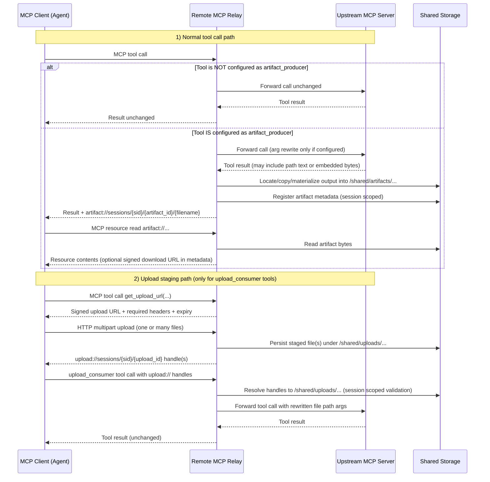

# Remote MCP Adapter

> A stateful gateway that makes remote MCP servers work like local ones — solving the object upload and artifact retrieval gaps.

[](https://www.python.org/downloads/)
[](LICENSE)
[](Dockerfile)

---

[MCP](https://modelcontextprotocol.io/) is great. It already supports remote servers via Streamable HTTP — so teams 
that want to consolidate their MCP tools behind a central gateway (governance, policy, shared infra, whatever 
the reason) absolutely can.

The catch? Most MCP servers were built assuming localhost. They work fine locally, but go remote, and you hit two real problems:

| Gap | What Happens                                                                                                                        |
|-----|-------------------------------------------------------------------------------------------------------------------------------------|
| **Upload gap** | A tool expects a local file path (e.g. "upload this PDF") — but the file is on the *client's* machine. The server can't reach it.   |
| **Artifact gap** | A tool produces a file (e.g. a screenshot, a PDF) and writes it to the *server's* filesystem. The client has no way to get it back. |

This adapter sits in the middle and fixes both. Uploads get staged through the adapter so the upstream server can 
access them. Artifacts get captured, stored, and handed back to clients as MCP resources or download links. 
Everything else passes through unchanged — your tools, prompts, and resources work exactly as before.

---

## Getting Started

For all examples and most documentation, we will be using the 
[Playwright MCP](https://github.com/microsoft/playwright-mcp) server as our upstream.

### Docker Compose (recommended)

The repo includes a working [`compose.yaml`](compose.yaml) that starts the adapter with 
 as an example upstream server.

```bash
git clone https://github.com/aakashH242/remote-mcp-relay.git
cd remote-mcp-relay

# Edit config.yaml to point to your upstream servers
docker compose up --build
```

The adapter is now listening at `http://localhost:8932`. 
Each upstream server is available at its configured `mount_path` - `/mcp/playwright` in this example.

### From Source

Requires Python 3.12+ and [uv](https://docs.astral.sh/uv/).

```bash
git clone https://github.com/aakashH242/remote-mcp-relay.git
cd remote-mcp-adapter

uv sync
uv run remote-mcp-adapter --config config.yaml
```

### Configure in IDE/Agent

**OpenAI Codex**

Add the adapter in `config.toml`.

```toml
[mcp_servers.playwright]
url = "http://localhost:8932/mcp"
```

**GitHub Copilot**

Add the adapter in `mcp.json`. 

```json
{
	"servers": {
      "playwright": {
        "url": "http://localhost:8932/mcp/playwright",
			"type": "http", 
        "headers": {
          "X-Mcp-Adapter-Auth-Token": "${input:mcp-adapter-token}"
        }
      }
    },
   "inputs": [{
      "type": "promptString",
      "id": "mcp-adapter-token",
      "description": "Enter the authentication token for the MCP adapter",
      "password": true
    }]
}
```

**Antigravity**

Add the adapter in `mcp_config.json`.

```json
{
    "mcpServers": {
        "playwright": {
            "serverUrl": "http://localhost:8932/mcp/playwright"
        }
    }
}
```

---

## Key Features

- 🌐 **Multi-server gateway** — mount multiple upstream MCP servers at separate HTTP paths, each with independent configuration
- ⬆️ **Upload staging** — pass local files to tools using session-scoped artifact handles
- 📬 **Artifact capture** — get artifacts generated by tools as session-scoped MCP resources with optional download links
- ⏳ **Session management** — idle TTL expiry, tombstone/revival for graceful reconnects, per-session quotas
- 💾 **Persistence backends** — `memory` (dev), `disk` (SQLite — single-node default), `redis` (multi-replica)
- 💓 **Upstream health monitoring** — active ping loop with circuit breaker (closed → open → half-open)
- 🔁 **Resilient upstream connections** — auto-reconnect and retry on upstream session termination or timeout
- 🔒 **Security** — bearer token auth, HMAC-signed one-time upload URLs, session-scoped isolation
- 📊 **Observability** — OpenTelemetry metrics and optional log export (OTLP gRPC/HTTP)
- 🛡️ **Storage safety** — atomic writes, orphan file sweeper, global + per-session storage quotas

---

## Configuration

The only required section is `servers[]`. Everything else has safe defaults.

### Minimal Example

```yaml
servers:
  - id: "playwright"
    mount_path: "/mcp/playwright"
    upstream:
      url: "http://localhost:8931/mcp"

    adapters:
      - type: "upload_consumer"
        tools: ["browser_file_upload"]
        file_path_argument: "paths"

      - type: "artifact_producer"
        tools: ["browser_take_screenshot", "browser_pdf_save"]
        output_path_argument: "filename"
        output_locator:
          mode: "regex"
```

### Full Reference

> See [`config.yaml.template.yaml`](config.yaml.template.yaml) for details on every configuration section and controls. 

Almost every aspect of the adapter is tunable in order to cater to a broad set of deployment scenarios.

**Override precedence** (most specific wins):
```
adapter.overrides  >  server.tool_defaults  >  core.defaults
```

<details>
<summary><b><code>core</code></b> — Runtime behavior, networking, auth, and global defaults</summary>

Controls how the adapter process itself behaves — where it listens, how it authenticates requests, and what defaults apply to all tool calls.

| Field | Default | Purpose |
|-------|---------|---------|
| `host` | `0.0.0.0` | IP address to bind to |
| `port` | `8932` | TCP port |
| `log_level` | `warning` | Minimum log level (`debug` / `info` / `warning` / `error` / `critical`) |
| `max_start_wait_seconds` | `60` | How long to wait for upstreams during startup before starting in degraded mode |
| `cleanup_interval_seconds` | `60` | Background cleanup loop interval (expired uploads, artifacts, idle sessions) |
| `public_base_url` | `null` | Explicit external URL (set when behind a proxy/ingress) |
| `allow_artifacts_download` | `false` | Register HTTP `GET /artifacts/...` download endpoint |
| `upload_path` | `/upload` | Base path for the multipart upload endpoint |
| `upstream_metadata_cache_ttl_seconds` | `300` | Cache TTL for `list_tools`/`list_resources` calls to upstreams |

<details>
<summary><code>core.auth</code> — Authentication</summary>

| Field | Default | Purpose |
|-------|---------|---------|
| `enabled` | `false` | Enforce bearer token auth on all requests |
| `header_name` | `X-Mcp-Adapter-Auth-Token` | HTTP header name clients must include |
| `token` | `null` | The secret token value (use `${ENV_VAR}` — never commit) |
| `signed_upload_ttl_seconds` | `120` | Lifetime of HMAC-signed upload URLs |
| `signing_secret` | `null` | Separate HMAC signing secret (falls back to `token` when null) |

</details>

<details>
<summary><code>core.cors</code> — Cross-Origin Resource Sharing</summary>

| Field | Default | Purpose |
|-------|---------|---------|
| `enabled` | `false` | Add CORS headers (only needed for browser-based clients) |
| `allowed_origins` | `[]` | Origins allowed for cross-origin requests |
| `allowed_methods` | `["POST","GET","OPTIONS"]` | HTTP methods permitted in CORS pre-flight |
| `allowed_headers` | `["*"]` | Headers permitted in cross-origin requests |
| `allow_credentials` | `false` | Allow cookies/credentials in cross-origin requests |

</details>

<details>
<summary><code>core.defaults</code> — Global tool-call defaults</summary>

| Field | Default | Purpose |
|-------|---------|---------|
| `tool_call_timeout_seconds` | `60` | Global timeout for upstream tool calls |
| `allow_raw_output` | `false` | Include base64-encoded file bytes in artifact tool responses |

</details>

<details>
<summary><code>core.upstream_ping</code> — Circuit breaker</summary>

| Field | Default | Purpose |
|-------|---------|---------|
| `enabled` | `true` | Run active health ping loop per upstream |
| `interval_seconds` | `15` | Seconds between consecutive pings |
| `timeout_seconds` | `5` | Ping response timeout |
| `failure_threshold` | `3` | Consecutive failures to trip the circuit breaker |
| `open_cooldown_seconds` | `30` | Seconds breaker stays open before half-open probes |
| `half_open_probe_allowance` | `2` | Successful probes needed to close the breaker |

</details>

</details>

<details>
<summary><b><code>storage</code></b> — Filesystem layout, write safety, and capacity limits</summary>

Governs where upload and artifact files physically live, how writes are coordinated across workers, and how orphan files get cleaned up.

| Field | Default | Purpose |
|-------|---------|---------|
| `root` | `/data/shared` | Root directory for all files — mount a persistent volume here |
| `max_size` | `null` | Global storage cap across all uploads + artifacts (accepts `50Gi`, `500M`, etc.) |
| `atomic_writes` | `true` | Write-to-temp → fsync → atomic rename (prevents torn files on crash) |
| `lock_mode` | `auto` | Write concurrency: `none` / `process` / `file` / `redis` / `auto` |
| `orphan_sweeper_enabled` | `true` | Clean up files with no matching metadata (crash leftovers) |
| `orphan_sweeper_grace_seconds` | `300` | Minimum file age before orphan deletion (avoids racing with in-flight writes) |
| `artifact_locator_policy` | `storage_only` | Where artifact files can be sourced from (`storage_only` / `allow_configured_roots`) |
| `artifact_locator_allowed_roots` | `[]` | Additional filesystem roots the artifact locator can read from (required when policy is `allow_configured_roots`) |

</details>

<details>
<summary><b><code>sessions</code></b> — Client connection lifecycle, quotas, and resilience</summary>

Each MCP client connection maps to a session (keyed on `Mcp-Session-Id`). This section controls how long sessions live, how many can exist, and what happens when they expire.

| Field | Default | Purpose |
|-------|---------|---------|
| `max_active` | `null` | Max concurrent sessions across all servers (HTTP 429 when exceeded) |
| `max_in_flight_per_session` | `null` | Max simultaneous tool calls within one session |
| `idle_ttl_seconds` | `null` | Inactivity timeout before session expiry |
| `allow_revival` | `true` | Tombstone expired sessions instead of deleting — allows transparent reconnect |
| `tombstone_ttl_seconds` | `86400` | How long tombstoned session metadata is kept before permanent deletion |
| `upstream_session_termination_retries` | `1` | Auto-retry count when upstream says "session terminated" (0–5) |
| `max_total_session_size` | `null` | Per-session storage quota (uploads + artifacts combined) |
| `eviction_policy` | `lru_uploads_then_artifacts` | What gets evicted first when session quota is hit |

</details>

<details>
<summary><b><code>uploads</code></b> — File staging behavior for upload_consumer tools</summary>

Controls how client-uploaded files are accepted, validated, and retained before a tool consumes them.

| Field | Default | Purpose |
|-------|---------|---------|
| `enabled` | `true` | Master switch for upload functionality |
| `max_file_bytes` | `10Mi` | Max size per uploaded file (accepts `10M`, `50Ki`, etc.) |
| `ttl_seconds` | `120` | How long staged files are kept before auto-cleanup |
| `require_sha256` | `false` | Require clients to provide a SHA-256 checksum for integrity verification |
| `uri_scheme` | `upload://` | Scheme used in upload handles returned to clients |

</details>

<details>
<summary><b><code>artifacts</code></b> — Output capture and exposure for artifact_producer tools</summary>

Controls how tool-generated files are retained and made available to clients.

| Field | Default | Purpose |
|-------|---------|---------|
| `enabled` | `true` | Master switch for artifact capture |
| `ttl_seconds` | `600` | How long artifacts are kept before auto-cleanup |
| `max_per_session` | `null` | Cap on artifacts per session |
| `expose_as_resources` | `true` | Make artifacts browsable as standard MCP resources (`artifact://` URIs) |
| `uri_scheme` | `artifact://` | Scheme used in artifact resource URIs |

</details>

<details>
<summary><b><code>state_persistence</code></b> — Metadata durability and crash recovery</summary>

Controls where session/upload/artifact **metadata** is stored (not the files themselves — those always go under `storage.root`). Determines what happens if the backend goes down mid-operation.

| Field | Default | Purpose |
|-------|---------|---------|
| `type` | `disk` | Backend: `memory` (no durability), `disk` (SQLite), `redis` (multi-replica) |
| `refresh_on_startup` | `false` | Discard saved metadata and start fresh |
| `snapshot_interval_seconds` | `30` | How often in-memory state is saved to disk (only for `type: memory`) |
| `unavailable_policy` | `fail_closed` | What to do when backend is unreachable: `fail_closed` / `exit` / `fallback_memory` |

<details>
<summary><code>reconciliation</code> — Startup filesystem scan</summary>

| Field | Default | Purpose |
|-------|---------|---------|
| `mode` | `if_empty` | When to reconcile: `disabled` / `if_empty` / `always` |
| `legacy_server_id` | `null` | Server ID to attribute ambiguous legacy files to |

</details>

<details>
<summary><code>disk</code> — SQLite backend</summary>

| Field | Default | Purpose |
|-------|---------|---------|
| `local_path` | auto | Database path (defaults to `{storage.root}/state/adapter_state.sqlite3`) |
| `wal.enabled` | `true` | SQLite WAL journaling mode (disable only on filesystems that don't support it) |

</details>

<details>
<summary><code>redis</code> — Redis backend</summary>

| Field | Default | Purpose |
|-------|---------|---------|
| `host` | `null` | Redis server hostname (required when `type: redis`) |
| `port` | `6379` | Redis TCP port |
| `db` | `0` | Redis logical database index |
| `username` | `null` | Redis ACL username (v6+) |
| `password` | `null` | Redis AUTH password |
| `tls_insecure` | `false` | Skip TLS certificate verification (dev only) |
| `key_base` | `mcp_remote_adapter` | Key namespace prefix to avoid collisions |
| `ping_seconds` | `5` | Seconds between Redis health-check pings |

</details>

</details>

<details>
<summary><b><code>telemetry</code></b> — OpenTelemetry metrics and log export</summary>

Optional observability. When enabled, the adapter exports metrics (and optionally logs) via OTLP to your collector.

| Field | Default | Purpose |
|-------|---------|---------|
| `enabled` | `false` | Master switch — no telemetry providers are initialized when false |
| `transport` | `grpc` | OTLP protocol: `grpc` or `http` |
| `endpoint` | auto | Metrics OTLP endpoint (defaults to `localhost:4317` for gRPC) |
| `logs_endpoint` | `null` | Dedicated OTLP endpoint for logs (HTTP transport only) |
| `insecure` | `true` | Plaintext gRPC (set `false` for TLS) |
| `headers` | `{}` | Extra OTLP headers on every export (e.g. vendor auth tokens) |
| `emit_logs` | `false` | Also export application logs as OTel log records |
| `service_name` | `remote-mcp-adapter` | OTel resource attribute for service identity |
| `service_namespace` | `null` | Optional namespace for service grouping |
| `export_interval_seconds` | `15` | Metrics collection/export cadence |
| `export_timeout_seconds` | `10` | OTLP exporter operation timeout |
| `max_queue_size` | `5000` | Internal async queue sizing for telemetry events |
| `queue_batch_size` | `256` | Max events processed per worker drain cycle |
| `periodic_flush_seconds` | `5` | Force-flush cadence for telemetry providers |
| `shutdown_drain_timeout_seconds` | `10` | Grace period for draining queued events during shutdown |
| `drop_on_queue_full` | `true` | Drop events instead of blocking when queue is full |
| `flush_on_shutdown` | `true` | Force flush during normal shutdown |
| `flush_on_terminate` | `true` | Best-effort drain on interpreter termination |
| `log_batch_max_queue_size` | `null` | OTel log batch processor queue size (SDK default) |
| `log_batch_max_export_batch_size` | `null` | Max log records per OTel batch export (SDK default) |
| `log_batch_schedule_delay_millis` | `null` | Delay between scheduled log batch exports (SDK default) |
| `log_batch_export_timeout_millis` | `null` | Timeout per log export operation (SDK default) |

</details>

<details>
<summary><b><code>servers[]</code></b> — Per-upstream server definitions (required)</summary>

The only required section. Each entry defines one upstream MCP server to proxy, its mount path, and which tools get adapter treatment.

| Field | Default | Purpose |
|-------|---------|---------|
| `id` | *(required)* | Unique identifier for this upstream (used in URLs, logging, storage paths) |
| `mount_path` | *(required)* | HTTP path where this server is accessible (e.g. `/mcp/playwright`) |

<details>
<summary><code>upstream</code> — Connection to the actual MCP server</summary>

| Field | Default | Purpose |
|-------|---------|---------|
| `url` | *(required)* | URL of the upstream MCP server |
| `transport` | `streamable_http` | MCP transport protocol (`streamable_http` / `sse`) |
| `insecure_tls` | `false` | Skip TLS cert verification for upstream (dev only) |
| `static_headers` | `{}` | Static headers injected into every upstream request |
| `client_headers.required` | `[]` | Client headers that must be present (HTTP 400 if missing) |
| `client_headers.passthrough` | `[]` | Client headers forwarded to upstream when present |

</details>

<details>
<summary><code>tool_defaults</code> — Per-server tool-call overrides</summary>

| Field | Default | Purpose |
|-------|---------|---------|
| `tool_call_timeout_seconds` | `null` | Per-server timeout override (inherits from `core.defaults`) |
| `allow_raw_output` | `null` | Per-server raw output override |

</details>

<details>
<summary><code>upstream_ping</code> — Per-server circuit breaker overrides</summary>

All fields are nullable and inherit from `core.upstream_ping` when unset.

| Field | Default | Purpose |
|-------|---------|---------|
| `enabled` | `null` | Override whether ping monitoring is active |
| `interval_seconds` | `null` | Override ping interval |
| `timeout_seconds` | `null` | Override ping timeout |
| `failure_threshold` | `null` | Override failure count to trip the breaker |
| `open_cooldown_seconds` | `null` | Override open-state cooldown |
| `half_open_probe_allowance` | `null` | Override probes needed to close the breaker |

</details>

<details>
<summary><code>adapters[]</code> — Request/response interception pipeline</summary>

Each entry wraps one or more upstream tools. A tool may appear in only one adapter (first wins).

**`upload_consumer`** — rewrites `upload://` handles to filesystem paths:

| Field | Default | Purpose |
|-------|---------|---------|
| `tools` | *(required)* | Tool names to intercept |
| `file_path_argument` | *(required)* | Argument name holding the `upload://` URI (supports dot-paths) |
| `uri_scheme` | `upload://` | Expected URI scheme in argument values |
| `uri_prefix` | `null` | Convert resolved paths to `file://` URIs when `true` |
| `overrides.*` | `null` | Per-adapter timeout/raw-output overrides |

**`artifact_producer`** — captures tool-generated files:

| Field | Default | Purpose |
|-------|---------|---------|
| `tools` | *(required)* | Tool names to intercept |
| `output_path_argument` | `null` | Argument to inject the pre-allocated output path into |
| `output_locator.mode` | `none` | How to find the file: `structured` / `regex` / `embedded` / `none` |
| `output_locator.output_path_key` | `null` | Dot-path into structured result (required for `structured` mode) |
| `output_locator.output_path_regexes` | `[]` | Custom regex patterns for `regex` mode (built-in defaults used when empty) |
| `persist` | `true` | Store the file in the artifact store |
| `expose_as_resource` | `true` | Register as a session-scoped MCP resource |
| `allow_raw_output` | `null` | Embed base64 file bytes in tool response |
| `overrides.*` | `null` | Per-adapter timeout/raw-output overrides |

</details>

</details>

<details>

<summary>Boring stuff</summary>

## Concepts

Every tool on an upstream MCP server falls into one of three categories:

- **Upload consumer** — needs a file from the client's local storage (e.g. "convert this PDF", "upload this image to a form field"). The file doesn't exist on the server, so the tool can't work as-is.
- **Artifact producer** — generates a file that ends up on the server's filesystem (e.g. "take a screenshot", "save page as PDF", "save trace logs"). The client has no way to retrieve it.
- **Passthrough** — works entirely with in-flight data. No local files involved on either side. These tools just work remotely without any help.

Users tell the adapter which tools are which via `config.yaml`. The adapter then **wraps** those tools so clients see a modified version:

- **Upload consumers** get their descriptions annotated with upload instructions. When called, the adapter intercepts the file path argument, resolves any `upload://` handle to the actual staged file on disk, and forwards the rewritten call upstream. A per-server helper tool (`<server_id>_get_upload_url`) is also registered so clients can discover where and how to stage files.

- **Artifact producers** get a controlled output path injected before the call goes upstream. After the tool runs, the adapter locates the generated file (using regex pattern matching, structured key lookup, embedded base64 extraction, or just the pre-allocated path), copies it into session-scoped storage, and enriches the response with `artifact://` resource URIs and optional download links. 

- **Passthrough tools** are forwarded upstream with zero modification — the adapter is invisible.

All of this is **session-scoped**. Each MCP client connection gets its own isolated namespace (keyed on `Mcp-Session-Id`).
Uploads, artifacts, and quotas are all tracked per-session. Sessions have configurable idle TTLs, and expired sessions 
can be tombstoned and revived if the client reconnects within a grace window.

---

## How It Works



---

### Upload Flow

When a tool needs a file from the client, the adapter injects a helper tool (`<server_id>_get_upload_url`) 
that returns a signed upload URL. The client POSTs the file to that URL and receives an `upload://` handle. 
When the client calls the actual tool with that handle, the adapter resolves it to the staged file's local path 
and forwards it upstream.

---

### Artifact Flow

When a tool produces a file on the upstream server, the adapter intercepts the result, locates the output 
file (via regex, structured metadata, or embedded content), copies it into session-scoped storage, 
and exposes it back to the client as:
- A standard **MCP resource** (accessible via `artifact://` URIs)
- Optionally, an **HTTP download URL** included in the tool response

---

### Everything Else

All other MCP operations — tool calls, resource reads, prompt retrieval — pass through transparently. The adapter is 
a faithful proxy for anything that doesn't need file mediation.

---

</details>


---

## Adapter Types

Adapters are 

### `upload_consumer`

For tools that need a file from the client. The adapter rewrites `upload://` handles in the tool's arguments to local filesystem paths before forwarding upstream.

```yaml
adapters:
  - type: "upload_consumer"
    tools: ["convert_to_markdown"]      # which tools to intercept
    file_path_argument: "uri"           # which argument holds the file path
    uri_prefix: true                    # forward as file:// URI instead of raw path
```

**What happens under the hood:**
1. Adapter registers a `<server_id>_get_upload_url` helper tool
2. Client calls it → gets a signed upload URL
3. Client POSTs the file → gets an `upload://` handle
4. Client calls the real tool with the handle → adapter resolves it to the staged file path → forwards upstream

### `artifact_producer`

For tools that generate files. The adapter captures the output, stores it in session-scoped storage, and enriches the response.

```yaml
adapters:
  - type: "artifact_producer"
    tools: ["browser_take_screenshot"]  # which tools to intercept
    output_path_argument: "filename"    # argument the adapter controls for output path
    output_locator:
      mode: "regex"                     # how to find the file: regex | structured | embedded | none
```

**Locator modes:**
| Mode | How it finds the file |
|------|----------------------|
| `regex` | Scans text content blocks for file paths using configurable patterns |
| `structured` | Reads a dotted key path from the structured result (`output_path_key`) |
| `embedded` | Extracts base64-encoded blobs or images directly from the response |
| `none` | No capture — the pre-allocated path argument is the only materialization source |

---

## Connecting Your MCP Client

Point your MCP client at:

```
http://<host>:<port>/<mount_path>
```

Using **Streamable HTTP** transport. For example, with the default config:

```
http://localhost:8932/mcp/playwright
```

The adapter speaks standard MCP — any client that supports remote Streamable HTTP servers will work.

If auth is enabled, include the token header on every request:
```
X-Mcp-Adapter-Auth-Token: <your-token>
```

---

## Health & Diagnostics

The adapter exposes a health endpoint at:

```
GET /healthz
```

It reports:
- Per-upstream circuit breaker state (`closed` / `open` / `half_open`) with ping latency
- Persistence backend health
- Adapter wiring status
- Startup readiness

---

## License

[MIT](LICENSE)
