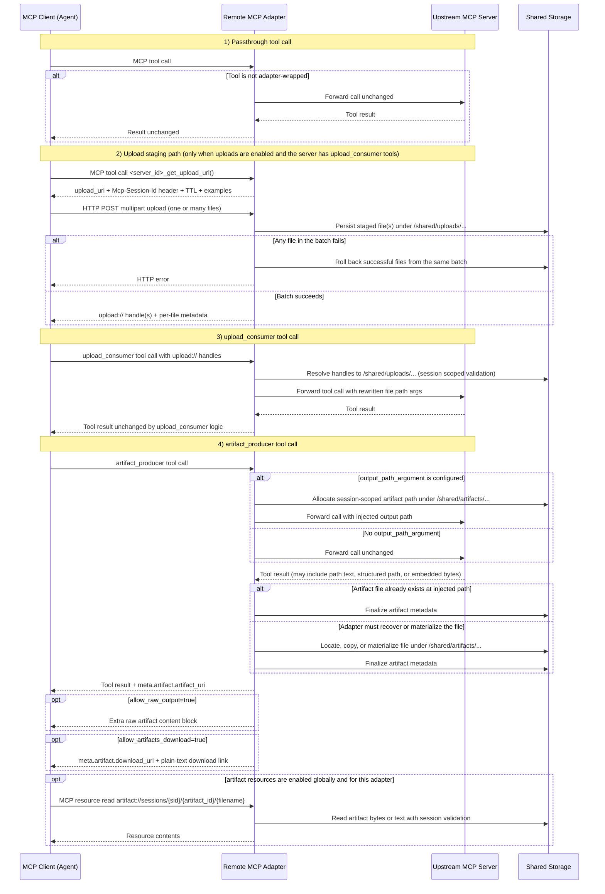

# How It Works

**What you'll learn here:** how tool categories are wired from config, and what request/response flow looks like for uploads and artifacts.

---

## Tool categories

Tool behavior is defined explicitly by `servers[].adapters[]`. Nothing is inferred from tool names.

### Upload consumer

`upload_consumer` tools receive `upload://` handles in the configured argument path. Before forwarding upstream, the adapter resolves each handle to the staged filesystem path for that same session.

### Artifact producer

`artifact_producer` tools have two possible capture paths:

- If `output_path_argument` is configured, the adapter allocates a session-scoped artifact path before the upstream call and injects that path into the tool arguments.
- If the tool cannot write directly to a supplied path, or ignores it, the adapter falls back to post-call recovery using `output_locator.mode`:
  - `regex`
  - `structured`
  - `embedded`
  - `none`

After capture, the adapter finalizes artifact metadata and exposes an `artifact://` URI in `meta.artifact.artifact_uri`. When HTTP downloads are enabled, the same tool result also includes `meta.artifact.download_url`.

### Passthrough

Any tool not listed in an adapter entry is passthrough and is proxied without modification.

---

## Adapter wiring

At startup, the adapter fetches upstream tools (`list_tools`) and applies wrappers for configured entries.

- Upload helper tools are added only when that server has `upload_consumer` adapters and `uploads.enabled: true`.
- If a configured tool is missing upstream, wiring remains incomplete and `/healthz` reports `adapter_wiring_incomplete`.

See [Configuration](configuration.md) and [Config Reference](configuration/config-reference.md) for exact fields.

---

## Request flow

---

## Session mapping note

The adapter keeps an upstream session per client session. If upstream session termination occurs, the adapter retries according to `sessions.upstream_session_termination_retries`.

---

## Next steps

- **Next:** [Configuration](configuration.md) - move from concepts to actual config structure.
- **See also:** [Core Concepts](core-concepts.md) - user-facing model.
- **See also:** [Config Reference](configuration/config-reference.md) - complete field reference.
